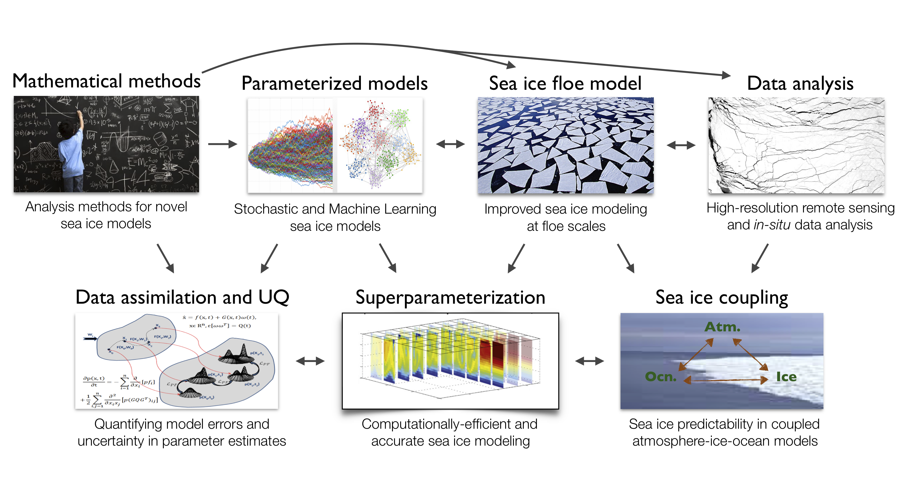

## Mission Statement

Physical modeling and understanding of sea ice dynamics and its relationship to the atmosphere and ocean is of critical importance to twenty-first century science, impacting human socioeconomic activities in the Arctic and across the Earth. 

Sea ice is a truly multiscale phenomenon: its dynamics is heavily influenced by large-scale circulation of the ocean and atmosphere, as well as by small-scale thermodynamic and mechanical processes. Yet, despite its fundamental importance, the modeling of sea ice, particularly on intermediate scales of order 1–100 km and hours–weeks, is still in its infancy, with most operational prediction systems relying on continuum models that were not devised to represent sea ice mechanics and thermodynamics on such small scales.

In response, the overarching goal of this project is to develop an improved mathematical framework for sea ice prediction from synoptic to pan-Arctic scales, which will fill the gap in our quantitative understanding of its evolution as a multiscale medium, enabling the development of the next-generation sea ice prediction systems.

## Collaborating Institutions

This project brings together researchers from Applied Mathematics,
Atomospheric, Oceanic and Cryospheric Sciences, and Computational
Science from several institutions:

- Courant Institute, New York University
- California Institute of Technology
- University of Washington
- University of Wisconsin-Madison
- Yale University
